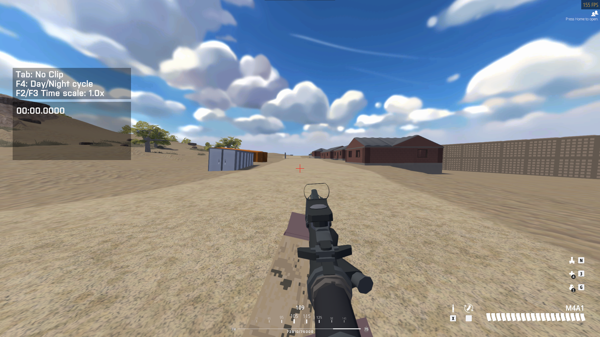

# Simple Crosshair Overlay

A performant native crosshair overlay without unnecessary bloat. Free and open-source software.

Click here to expand another screenshot demoing a custom PNG crosshair

## Features

- Works on any application that's not fullscreen exclusive. You **must** use windowed or borderless-windowed mode on your game. This was an intentional design choice, as rendering into a fullscreen-exclusive game is not anticheat-compatible.
- Performant: the overlay is only redrawn when you change the crosshair. CPU, GPU, and memory usage are minimal.
- Minimal UI: managed via a tray icon and hotkeys.
- Comes with a simple default crosshair that can be scaled and recolored to your preference.
- Can use custom PNG images as crosshairs.
- No installer. The only file this program creates is small configuration saved in `%appdata%\simple-crosshair-overlay`.

## Installation

1. Download simple-crosshair-overlay.exe from the [latest release](https://github.com/zkxs/simple-crosshair-overlay/releases/latest), and save it to a location of your choice
2. Run simple-crosshair-overlay.exe
3. Optionally, if you want a start menu shortcut you can make one yourself! Simply right-click simple-crosshair-overlay.exe and select "Pin to Start". This will automatically create a shortcut in `%appdata%\Microsoft\Windows\Start Menu\Programs`. 

**MacOS** binaries are available, but completely untested as I lack hardware to test against. See the [MacOS support tracking issue](https://github.com/zkxs/simple-crosshair-overlay/issues/3).

**Linux** is presently unsupported, pending resolution of a few issues. See the [Linux support tracking issue](https://github.com/zkxs/simple-crosshair-overlay/issues/6). Additionally, you must have the following prerequisites installed:
- libappindicator-gtk3

## Usage

Use the tray icon to:

- Toggle crosshair visibility (you can also use Ctrl+H)
- Toggle **Adjust Mode** (you can also use Ctrl+J)
- Pick a color for the default crosshair (you can also use Ctrl+K if you are in Adjust Mode).
- Load a PNG image as your crosshair
- Reset crosshair to default settings
- Safely exit the application and save your settings

In **Adjust Mode**:

- Arrow keys to move the crosshair
- PageUp/PageDown to increase/decrease the crosshair scale
- Ctrl+M to cycle through your monitors
- Ctrl+K to pick a color for the default crosshair

### Custom PNG Crosshairs

Your PNG file must use RGBA pixel format. Most PNGs are already saved this way, but you may need to specifically save
it with an alpha channel if Simple Crosshair Overlay is giving you an error.

Also note that changing the color of the built-in crosshair has no effect on custom PNG crosshairs. If you want your custom
crosshair in a different color you'll have to make that change in an image editor.

### Changing Hotkeys

Hotkeys cannot currently be changed in-application. To edit your hotkeys, do the following:

1. Open the config file `%appdata%\simple-crosshair-overlay\config\config.toml`. If this file does not exist, starting
   and exiting the program once will create it.
2. Change hotkeys in the `key_bindings` section by referencing the Keycode values defined in [keycode.rs](src-lib/hotkey/keycode.rs)

## Notes

Simple Crosshair Overlay supports 0.5 pixel alignment with the default crosshair by scaling it to an even or odd size. If this sounds nonsensical, I've written [a quick explanation of this concept](docs/crosshair-alignment.md). If you're using a custom PNG crosshair, then providing the correct even/odd size is up to you.

## Installing from Source

1. [Install Rust](https://www.rust-lang.org/tools/install)
2. `cargo install simple-crosshair-overlay`

## Building from Source

1. [Install Rust](https://www.rust-lang.org/tools/install)
2. Clone the project
3. `cargo build --release`

## Feedback

If you have bugs to report please let me know by opening an [issue](https://github.com/zkxs/simple-crosshair-overlay/issues).

For suggestions, questions, or even just to say hey, feel free to start a [discussion](https://github.com/zkxs/simple-crosshair-overlay/discussions).

## License

Copyright 2023 [Michael Ripley](https://github.com/zkxs).

Simple Crosshair Overlay is provided under the [GPL-3.0 license](LICENSE).
