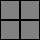

# Crosshair Alignment

To properly support all games, we need to be able to align the crosshair down to 0.5 pixel increments. Let me explain.

Many games fire from the center of the screen, but there isn't a pixel at the center of the screen. Take a look at this small, 2x2 pixel "screen" below:

As you can see, there isn't a single pixel at the center. Instead, there's an intersection of four pixels. This exact same thing happens on larger displays. 1920x1080, 1440x2560, 3840x2160, you get the idea: all of those are even numbers.

Here's an example 3x3 crosshair which can't possibly be centered on your screen.

The solution is to make a crosshair that's an even size. Here's a larger 6x6 crosshair which *can* be centered on your screen.

Both of the above crosshair examples are possible in Simple Crosshair Overlay: as you scale up the default crosshair you will notice the lines alternate between 1 pixel and 2 pixel thickness. It's up to you to use an even or odd size based on your personal preference and what's correct for the game you're playing.
